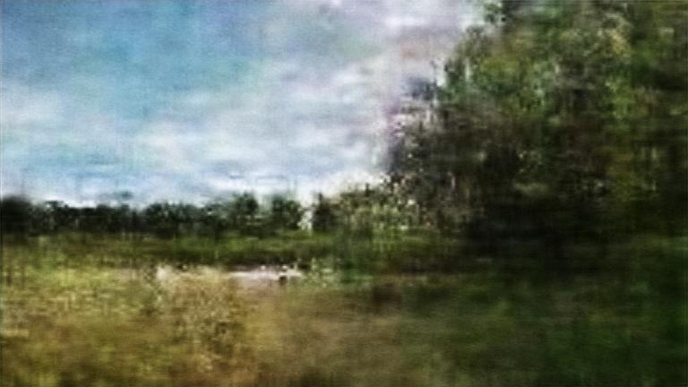

# LandscapeGAN

This repository contains the code for generating landscape imagery.

The code makes use of two types of neural networks for generating the landscape images:

  1) A GAN, which generates 192x108 images, training on the images provided in the sampleimages_lowres directory 
  2) An SRCNN, which takes 768x432 generated images (after being upscaled from 192x108), and generates higher resolution versions of these images
  
  

  
  ## Description of Scripts

At the time of writing, 6 main python scripts are used for generating the landscape images:

  1) train_imagegan.py
     - used for training the GAN, and saving the trained GAN model.
  2) train_srcnn.py
     - used for training the SRCNN, and saving the trained SRCNN model.
  3) image_downscale.py
     - used for downscaling the images from the sampleimages_highres directory into suitable resolutions for the sampleimages_midres (768x432) and sampleimages_lowres (192x108) directories, which is where the resulting images are stored.
     - this is done when if want to add images for the neural networks to train on (must be 1920x1080 and must be placed into sampleimages_highres).
  4) image_upscale.py
     - used for upscaling the 192x108 images generated by the GAN in the generatedimages directory, which are upscaled to 768x432 and stored in the generatedimages_upscaled directory.
  5) generate_images.py
     - used for generating a new set of landscape images, using the saved GAN model. The resulting images are stored in the generatedimages directory.
  6) srcnn_images.py
     - used for improving the resolution of the generated landscape images, using the saved SRCNN model. The resulting images are stored in the generatedimages_srcnn directory.
  
